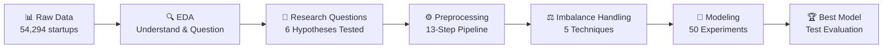
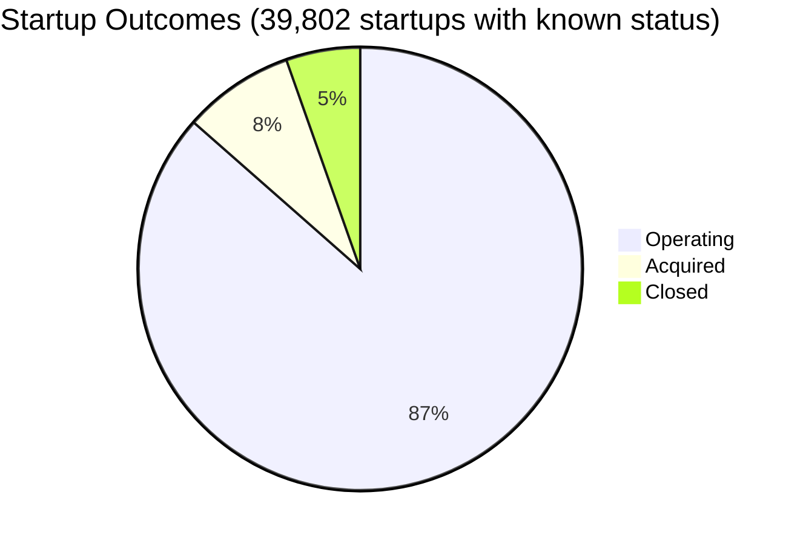
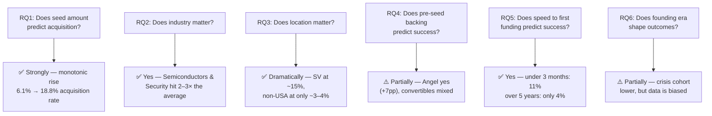
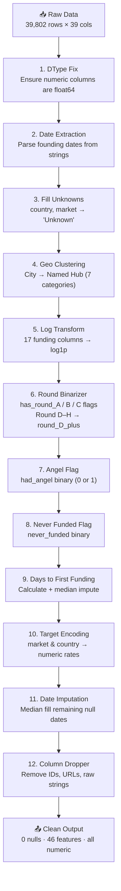
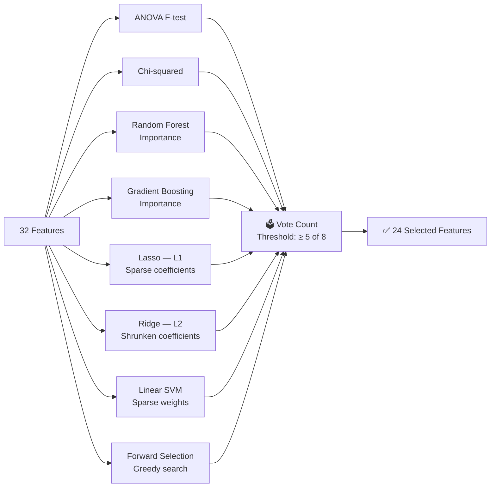
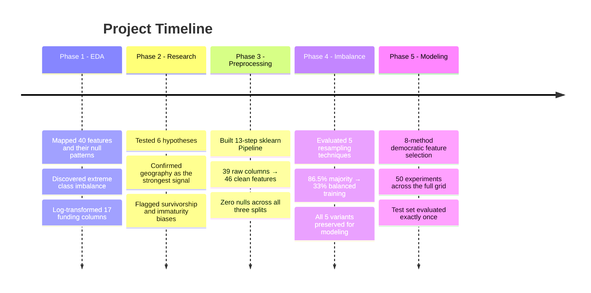

# Can We Predict Which Startups Win?
## A Data Science Journey Through the Venture Capital Universe

---

## The Question

Every year, thousands of startups are founded with a dream: build something great, get acquired, or grow into an empire. Most don't make it. But which ones do — and can we predict it from the data alone?

This project takes a dataset of **54,294 ventures** from the VC world and attempts to answer one deceptively simple question: **can we predict whether a startup will be acquired, continue operating, or shut down?**

Three outcomes. One dataset. Dozens of decisions. Here's the full story.

---

## The Project at a Glance



---

## Phase 1 — The Data Universe
### *Notebook 01: Exploratory Data Analysis*

Before building anything, we needed to understand what we were working with. And the data had... opinions.

### What We Found First

The dataset contains 40 features per startup: funding amounts across every stage (seed, angel, venture, private equity...), geographic data, founding dates, industry categories, and — most importantly — the **outcome**: `acquired`, `operating`, or `closed`.

The first plot stopped us in our tracks:



**86.5% of startups are still "operating."** Acquired and closed together make up less than 14% of the data. This wasn't just a curiosity — it was going to be the central challenge of the entire project.

### The Funding Landscape

Funding amounts were another beast. Plotted on a linear scale, every distribution looked like a wall with a tiny tail — a textbook power law:

```
Funding Distribution — Linear Scale
████████████████████▓▒░                          ← 90% cluster near zero
                           ░   ░      ░     ░    ← a few outliers at 100×–10000× scale
```

After a log transform, the same data told a completely different story:

```
Funding Distribution — Log Scale
        ░▒▓███████████████████▓▒░                ← smooth, near-normal bell curve
```

One transformation. Entire distributions unlocked. Every funding column got the same treatment.

### The Three Big Dilemmas

**Dilemma 1 — What does "no founding date" actually mean?**

Over 15,000 startups had no founding date — nearly a third of the dataset. Do we drop them? That's losing a massive chunk of training signal. Do we guess? That risks introducing noise. We explored KNN imputation, which would find similar startups and borrow their founding year — but the math was brutal: a **~1 GB pairwise distance matrix** at this scale. Completely infeasible.

In the end: median imputation. Simple, transparent, and honest about the uncertainty it leaves behind.

**Dilemma 2 — Is zero funding real, or just missing?**

A startup reporting $0 in seed funding could be two completely different things:
- A company that genuinely bootstrapped and received no external capital
- A company whose data was simply never recorded in the system

These two look identical in the dataset but mean opposite things for a model. We cross-referenced funding amounts against the binary round indicators (did they receive a Round A? B? C?) to separate true zeros from data gaps — and only then decided what to impute or drop.

**Dilemma 3 — Geography: breadth or signal?**

The dataset covers startups from 115 countries and cities across every continent. The raw data is rich — but how do you feed 115 countries into a model? One-hot encoding would explode the feature space. Treating city as a raw string means the model sees "San Francisco" and "Palo Alto" as totally different things, even though they're neighbors in the same startup ecosystem.

We took a deliberate step: **cluster cities into named geographic hubs**. Silicon Valley. New York. Boston. Seattle. Los Angeles. Everything else in the US. Everything outside the US. Seven categories that capture the real geographic signal without inflating dimensionality.

### The Decision Log

| Problem | Decision | Why |
|---------|----------|-----|
| Null founding dates (~15K rows) | Median imputation | KNN too memory-intensive; median is honest about uncertainty |
| Zero vs. missing funding | Cross-reference with round indicators | Two different signals; they deserve different treatment |
| 115 countries, 753 markets | Target encoding (mean acquisition rate) | Captures predictive signal without dimensionality explosion |
| Geographic spread | Cluster into 7 named hubs | City-level networks matter; interpretable and compact |
| Extreme funding skew | log1p transform on all 17 amount columns | Normalizes distributions; handles zero gracefully |
| Funding Rounds D–H | Collapse into single `round_D_plus` sum | Each late-stage round has <3% participation; too sparse individually |

---

## Phase 2 — The Detective Work
### *Notebook 02: Research Questions*

With a clean(ish) dataset, we turned to the real question: **what actually predicts acquisition?**

We formulated 6 hypotheses and tested each one. No model yet — just the data, speaking.



### The Findings That Surprised Us

**Geography is everything.** Silicon Valley startups are acquired at nearly **4× the rate** of non-US companies. This isn't just about company quality — it's about proximity to acquirers, investor culture, and the density of exit-oriented networks. New York sits in the middle. The rest of the world sits far behind.

**Speed signals conviction.** Startups that raised their first round within 3 months of founding had an 11% acquisition rate. Those that took over 5 years: just 4%. But is that causation or selection bias? Faster fundraising might reflect investor conviction — or it might reflect that only exceptional founders can close deals that quickly.

**Angel backing beats grants, decisively.** Angel-backed startups gained +7 percentage points in acquisition rate. Grants, surprisingly, barely moved the needle (+2–3pp). Angels bring capital, network connections, and credibility. Grants bring money and a stamp — but apparently not the same doors.

**Convertible notes are a mystery.** They showed mixed results — sometimes correlated with success, sometimes not. The hypothesis: convertibles are used in two very different situations (founder-friendly early deals AND bridge financing for struggling companies), so the signal blurs.

### The Dilemmas We Couldn't Fully Resolve

> **Survivorship bias:** Pre-2000 startups show the *highest* acquisition rates — but that's almost certainly because only the successful ones remain in the database. The failures were quietly removed years ago. We can't separate real cohort performance from database cleanup.

> **Immaturity bias:** 2012+ startups look like underperformers. But many simply haven't had enough time to be acquired yet. The data is frozen at a point in time; these companies may eventually be acquired. The observation window is too short to judge them fairly.

> **The causality trap:** Does more seed funding *cause* better outcomes? Or do better founders simply attract more capital? We couldn't answer this with correlational data. We flagged it explicitly and moved on — the model will learn correlations regardless of mechanism.

### What the Research Questions Built

Each RQ directly informed the feature engineering that followed:

| Research Question | Feature Created |
|-------------------|-----------------|
| RQ1 — Seed matters | `log_seed` (log-transformed amount) |
| RQ2 — Industry matters | `market_enc_acquired` (target-encoded rate) |
| RQ3 — Geography matters | `geo_cluster` (7-category hub) |
| RQ4 — Pre-seed matters | `had_angel` binary flag |
| RQ5 — Speed matters | `days_to_first_funding` |
| RQ6 — Era matters | `founded_year` (kept as numeric) |

---

## Phase 3 — The Great Cleanup
### *Notebook 03: Preprocessing*

Research questions answered. Time to build the machine that would transform raw data into model-ready inputs — consistently, reproducibly, and without leakage.

The rule: **fit on training data only. Apply identically to validation and test.** No exceptions.

### The Pipeline Architecture

A 13-step scikit-learn Pipeline. Every transformation in sequence, every parameter locked after fitting on the training set:



### The Data Split

| Set | Rows | Share | Purpose |
|-----|------|-------|---------|
| Train | 27,860 | 70% | Model fitting only |
| Validation | 5,971 | 15% | Hyperparameter tuning |
| Test | 5,971 | 15% | Final evaluation — touch once |

Stratified split: class proportions are identical in all three sets (~86.5% / 8.1% / 5.4%).

### The Transformation in Numbers

```
Before:  39 raw columns  ·  nulls throughout  ·  strings, dates, skewed amounts
After:   46 features     ·  0 nulls           ·  all numeric, all scaled, all clean
```

Seven additional features were engineered (binary flags, log transforms, geographic clusters, encoded categories). Twelve columns were removed (IDs, URLs, raw text, dates already parsed into numeric form).

The output: three CSV files that the rest of the project runs on.

---

## Phase 4 — Fighting the Imbalance
### *Notebook 04: Imbalanced Data Handling*

Here's the problem we knew was coming but still had to face directly.

### The Wall

Without intervention, train a model. What does it learn?

> *"86.5% of startups are 'operating.' If I just guess 'operating' every time, I'm 86.5% accurate."*

That's exactly what happened. A baseline XGBoost model hit **86.2% accuracy** — and was nearly useless for identifying acquisitions or closures. Macro F1 (which treats all three classes equally): **0.387**. Per-class breakdown was damning:

| Class | Baseline F1 |
|-------|------------|
| Closed | 0.068 |
| Operating | 0.926 |
| Acquired | 0.168 |

The model had learned to ignore the two most interesting outcomes entirely.

### Before vs. After

```
Class Balance — Before Resampling
Operating  ████████████████████████████████████████████  86.5%
Acquired   ████░░░░░░░░░░░░░░░░░░░░░░░░░░░░░░░░░░░░░░   8.1%
Closed     ██░░░░░░░░░░░░░░░░░░░░░░░░░░░░░░░░░░░░░░░░   5.4%

Class Balance — After SMOTETomek
Operating  ██████████████░░░░░░░░░░░░░░░░░░░░░░░░░░░░  32.8%
Acquired   ██████████████░░░░░░░░░░░░░░░░░░░░░░░░░░░░  33.6%
Closed     ███████████████░░░░░░░░░░░░░░░░░░░░░░░░░░░  33.6%
```

### Five Strategies, One Leaderboard

We tested every major approach, no shortcuts:

| Strategy | Core Idea | Macro F1 | Accuracy | Training Rows |
|----------|-----------|----------|----------|---------------|
| Baseline | Nothing — model as-is | 0.387 | 86.2% | 27,860 |
| **ROS** (Random Over-Sampling) | Duplicate minority examples | 0.452 | 64.9% | ~72,000 |
| **RUS** (Random Under-Sampling) | Delete majority examples | 0.422 | 59.1% | ~4,500 |
| **SMOTE** | Synthesize minority neighbors | 0.466 | 83.9% | 62,364 |
| **SMOTETomek** | SMOTE + borderline cleanup | 0.479 | 83.8% | 62,364 |
| **Class Weights** | Reweight the loss function | 0.439 | 84.9% | 27,860 |

Each method has its own personality:

- **ROS** is the simplest — just copy the underdogs until they match the majority. Fast, but the model memorizes duplicates rather than generalizing.
- **RUS** is the most drastic — throw away majority samples until balance is achieved. Loses real, hard-won data.
- **SMOTE** is creative — synthesize entirely new minority examples by interpolating between real neighbors. The training set grew from 27,860 to **62,364 rows** of synthetic and real data combined.
- **SMOTETomek** adds one more step — after generating synthetic samples, it removes borderline examples from *both* sides of the decision boundary. Cleaner edges between classes.
- **Class Weights** doesn't touch the data at all — it tells the model "errors on minority classes cost more." No new data, just a different loss function.

All five variants were preserved and carried forward into modeling. No winner declared here — the 50-experiment grid would decide.

---

## Phase 5 — The Model Arena
### *Notebook 05: Feature Selection & Modeling*

Now the real experiment begins.

**5 models × 2 feature sets × 5 resampling strategies = 50 experiments.**

### First: Feature Selection

Before fitting anything, we ran a democratic feature election — 8 different methods, each casting a vote on whether a feature deserved to stay:



Features with ≥ 5 votes made the cut. Then: remove anything with pairwise correlation > 0.75. Six more features pruned. Final count: **24 features** out of 32.

**Why 8 methods?** No single method is always right. Statistical tests catch linear relationships. Tree importance finds non-linear interactions. Lasso automatically sparsifies. Forward selection discovers synergies *between* features. Together, they're more reliable than any one method in isolation — and the vote threshold makes selection robust to any one method's blind spots.

### The Experiment Grid

| Dimension | Options |
|-----------|---------|
| **Models** | Logistic Regression L2 · Logistic Regression L1 · Random Forest · Gradient Boosting · XGBoost |
| **Feature Sets** | All 32 features · Selected 24 features |
| **Resampling** | ROS · RUS · SMOTE · SMOTETomek · Class Weights |

Fifty runs. Every combination evaluated on the same validation set, using the same metric: **Macro F1**.

### Key Dilemmas in Modeling

**All features vs. selected features.** Tree-based models handle irrelevant features naturally — their splitting logic implicitly downweights noise. But linear models can struggle. The experiment tested whether 8 features of careful pruning made a measurable difference in practice — or whether it was unnecessary overhead.

**Preventing leakage.** Feature selection, scaler fitting, and hyperparameter tuning were all performed using only training data. The validation set evaluated choices — it never informed them. The test set was touched **exactly once**, at the very end, to report final numbers.

**Tuning vs. stability.** A model that's been extensively tuned on the validation set may have overfit to its specific characteristics. We ran 5-fold cross-validation on the training set as a sanity check: a Macro F1 gap larger than 0.02 between CV and validation would signal a problem.

### Evaluating Success

The primary metric throughout: **Macro F1** — the unweighted average F1 across all three classes. A model that's excellent at predicting "operating" but blind to acquisitions and closures is a failure, regardless of its overall accuracy. Macro F1 forces the model to care about all three outcomes equally.

---

## Phase 6 — Reflections

### What We Learned

**1. Imbalance is not a problem you solve once.**  
It follows you from preprocessing into modeling. Every decision — which resampling technique, which metric to optimize, how to set classification thresholds — is downstream of how you framed the imbalance problem at the start. We revisited it in every phase.

**2. Feature engineering matters more than model choice.**  
The gap between raw data and the final 46-feature engineered dataset was enormous. The gap between Random Forest and XGBoost was relatively small. Good features, grounded in domain understanding, trump sophisticated algorithms. Every binary flag we created — `had_angel`, `never_funded`, `round_D_plus` — was a decision that mattered.

**3. Correlation is not causation, and that's okay.**  
We can say with confidence that angel-backed Silicon Valley startups are acquired at higher rates than bootstrapped non-US ones. We cannot say *why* — network effects, selection effects, survivorship bias, and confounders are all tangled together. The model predicts patterns, not mechanisms. That's an honest scope, and being clear about it is part of good science.

### What We'd Do Differently

- **Model the time dimension more carefully** — startups founded later are inherently younger at observation time; a survival analysis framing might be more appropriate than static classification
- **Separate the binary tasks** — predicting "acquired vs. not" and "closed vs. not" as two independent problems might be cleaner than forcing a 3-way multiclass setup
- **Explore network features** — investor overlap, co-founder connections, shared board members. The dataset has hints of these relationships in the funding columns, but we didn't extract them

### The Full Journey



---

*Built as part of a Machine Learning course project · Dataset: VC investment records (Crunchbase-style) · 54,294 startups · 3 outcome classes*
