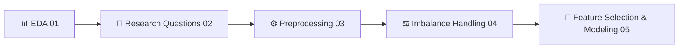
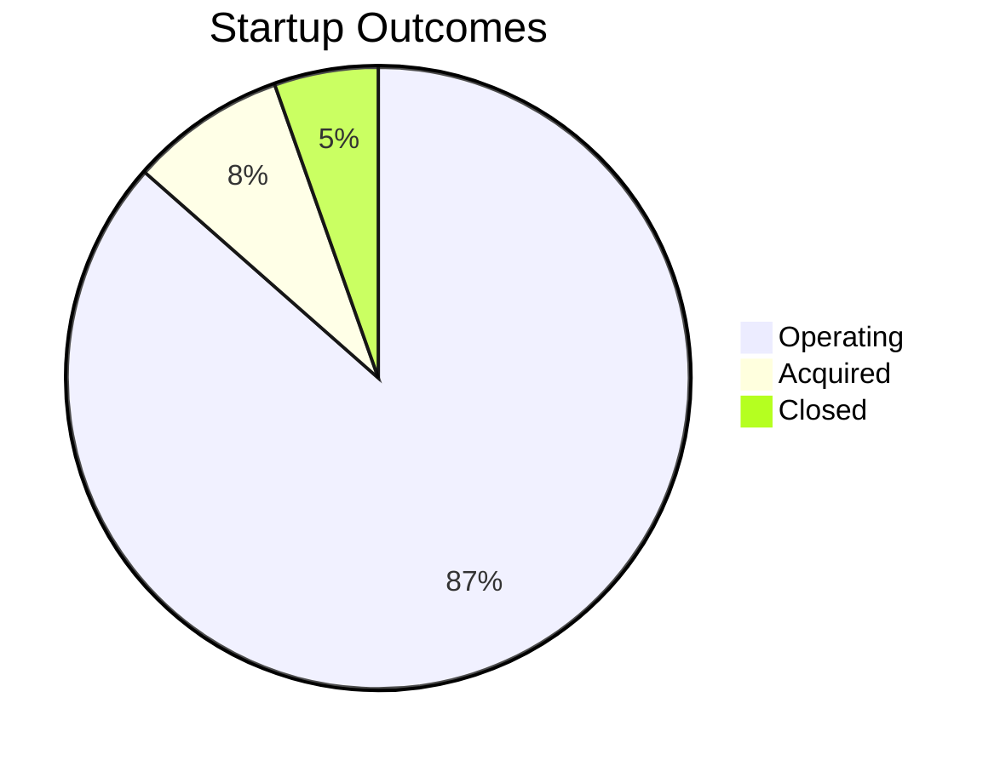
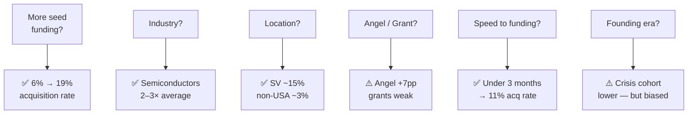
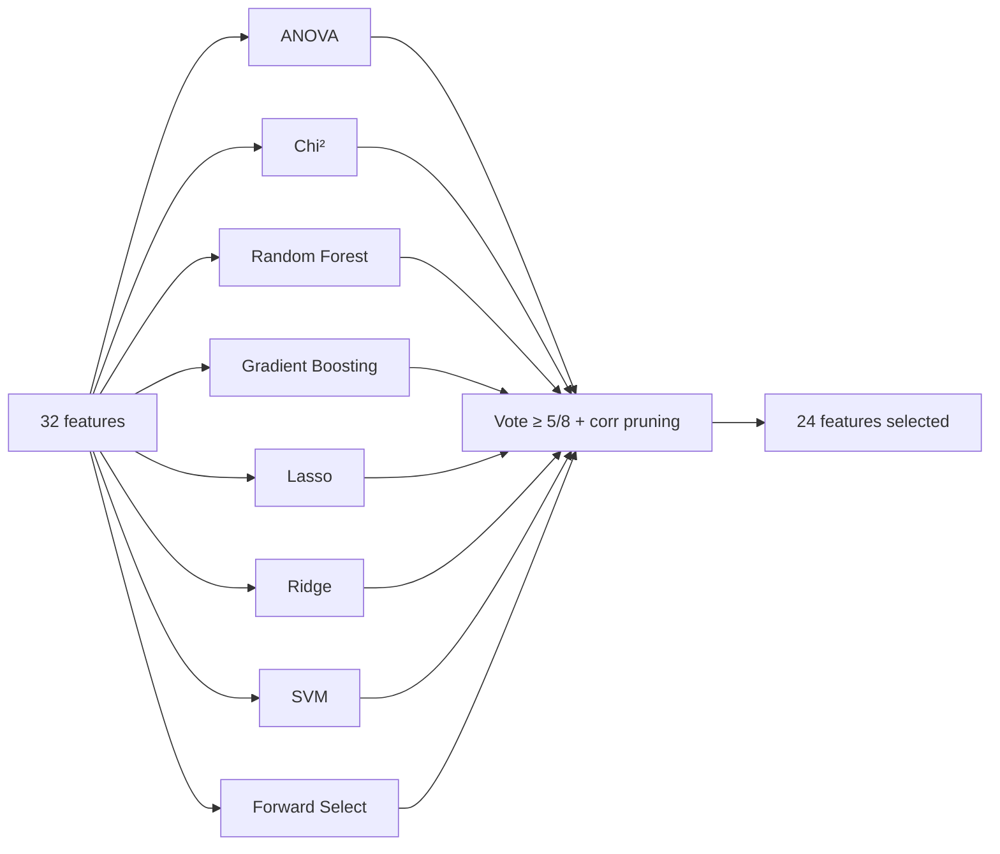

# Can We Predict Which Startups Win?

**54,294 startups · 3 outcomes · 5 notebooks**

---

## The Journey



Each notebook builds directly on the one before — decisions made in `01_EDA` shaped the pipeline in `03_Preprocessing`, and the resampling choices in `04` carried into every experiment in `05`.

---

## Phase 1 — EDA
### `01_EDA.ipynb`

The raw data had widespread nulls and no ready-to-use features. Before writing a single line of preprocessing code, we mapped every missing value pattern and decided how to handle it — drop, impute, or encode as "Unknown." At the same time, we identified which raw columns could be transformed into informative features: binary round flags, log-scaled funding amounts, geographic clusters, and target-encoded categories.



**Funding amounts — before and after log transform:**

```
LINEAR SCALE
seed  ████████████████████████████████████████░░░░    99% near zero, spikes at tail

LOG SCALE
seed       ░░▒▒████████████████████▒▒░░               near-normal distribution
```

### Null & Feature Engineering Decisions

| # | Problem Found | Decision Made |
|---|---------------|---------------|
| 1 | **15K+ rows missing founding date** | Median imputation per column (year / month / quarter) |
| 2 | **Geography dominated by USA** | Silicon Valley, NY, Boston, Seattle, LA → 7 named clusters |
| 3 | **753 markets, 115 countries** | One-hot encoding impractical → map markets → target encoding (mean acquisition rate) |
| 4 | **`funding_total_usd` vs `rounds_sum` mismatch** | Cross-referenced to separate true zeros from missing data |
| 5 | **Round amount columns mostly zeros** | Converted to binary flags: `has_round_A / B / C` |
| 6 | **Rounds D–H each below 3% participation** | Too sparse individually → collapsed to `round_D_plus` |

---

## Phase 2 — Research Questions
### `02_Research_Questions.ipynb`

We started with open, curious questions about what makes startups succeed — the kind you'd argue about over coffee. We then realized we could actually answer them with the data alone, no model needed.



| Bias | Problem |
|------|---------|
| **Survivorship** | Pre-2000 startups look best — failures were deleted from the dataset |
| **Immaturity** | 2012+ startups not old enough to be acquired yet |
| **Causality** | Correlation only — we can't say seed funding *causes* success |

---

## Phase 3 — Preprocessing
### `03_Preprocessing.ipynb`

Every decision from the EDA was translated into a step in a reproducible sklearn Pipeline — so the exact same transformations apply to train, validation, and test without any leakage.

```mermaid
flowchart LR
    IN["39 cols nulls everywhere"] --> P1["Fix dtypes"] --> P2["Parse dates"] --> P3["Fill unknowns"]
    P3 --> P4["Geo clusters"] --> P5["log1p funding"] --> P6["Round flags"]
    P6 --> P7["Angel flag"]  --> P8["Days to funding"]
    P8 --> P9["Target encode"] --> P10["Median impute dates"] --> P11["Drop raw cols"]
    P11 --> OUT["46 features 0 nulls"]
```



| Split | Rows | Share |
|-------|------|-------|
| Train | 27,860 | 70% |
| Validation | 5,971 | 15% |
| Test | 5,971 | 15% |

> Pipeline fitted on training data only — applied identically to validation and test.

---

## Phase 4 — Imbalance Handling
### `04_Imbalanced_Data_Handelling.ipynb`

The preprocessed training data had a 15:1 majority/minority ratio — a model with no intervention would simply learn to predict "operating" for everything. We evaluated five strategies to correct this before any model training began.

```
BEFORE RESAMPLING
Operating  ████████████████████████████████████████████  86.5%
Acquired   ████░░░░░░░░░░░░░░░░░░░░░░░░░░░░░░░░░░░░░░    8.1%
Closed     ██░░░░░░░░░░░░░░░░░░░░░░░░░░░░░░░░░░░░░░░░    5.4%

AFTER SMOTETomek
Operating  ██████████████░░░░░░░░░░░░░░░░░░░░░░░░░░░░   32.8%
Acquired   ██████████████░░░░░░░░░░░░░░░░░░░░░░░░░░░░   33.6%
Closed     ███████████████░░░░░░░░░░░░░░░░░░░░░░░░░░░   33.6%
```

| Strategy | Macro F1 | Accuracy | Train Rows |
|----------|----------|----------|------------|
| Baseline (none) | 0.387 | 86.2% | 27,860 |
| ROS | 0.452 | 64.9% | ~72,000 |
| RUS | 0.422 | 59.1% | ~4,500 |
| SMOTE | 0.466 | 83.9% | 62,364 |
| **SMOTETomek** | **0.479** | **83.8%** | **62,364** |
| Class Weights | 0.439 | 84.9% | 27,860 |

All 5 variants carried forward into modeling.

---

## Phase 5 — Feature Selection & Modeling
### `05_Feature_Selection_n_Modeling.ipynb`

We ran a democratic feature vote across 8 methods to select the 24 most informative features, then combined them with the full experiment grid — every model against every resampling strategy — to find the best combination. The test set was used exactly once at the end.



**The full experiment grid:**

| | All Features (32) | Selected Features (24) |
|--|:-----------------:|:---------------------:|
| Logistic Regression L2 | × 5 resampling | × 5 resampling |
| Logistic Regression L1 | × 5 resampling | × 5 resampling |
| Random Forest | × 5 resampling | × 5 resampling |
| Gradient Boosting | × 5 resampling | × 5 resampling |
| XGBoost | × 5 resampling | × 5 resampling |

**5 models × 2 feature sets × 5 resampling strategies = 50 experiments**

Primary metric: **Macro F1** (all three classes weighted equally). Test set touched exactly once.

---

## Key Lessons

- **Feature engineering beats model choice** — the 39 → 46 feature transformation mattered far more than which algorithm was used
- **Imbalance follows you everywhere** — resampling in `04` was only the beginning; every modeling decision downstream depended on it
- **Correlation is not causation** — we predict patterns, not mechanisms; that's an honest scope

---

*VC investment dataset · 54,294 startups · Machine Learning course project*
